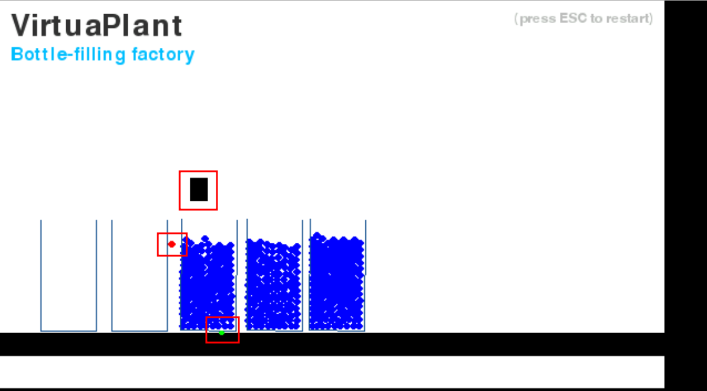
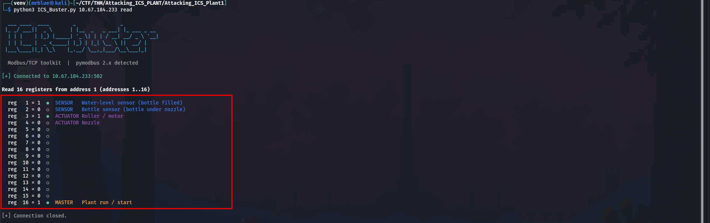
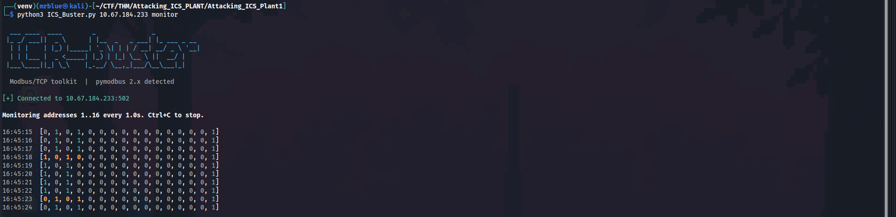
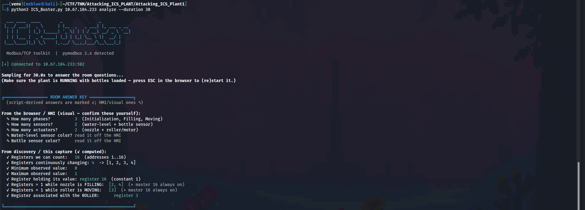
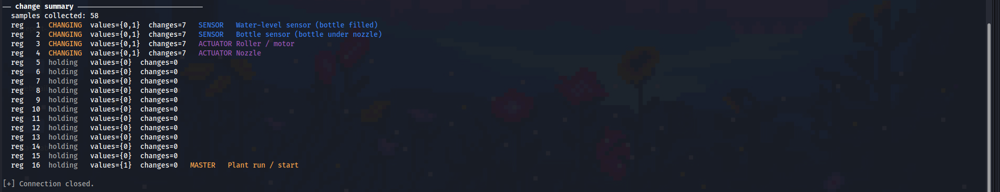
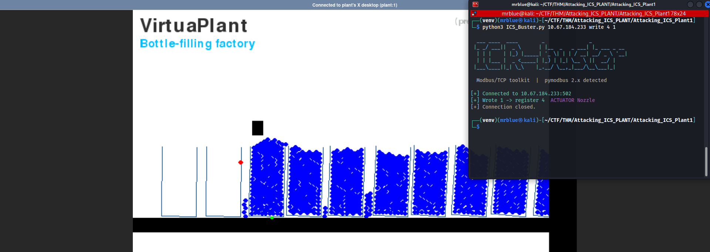
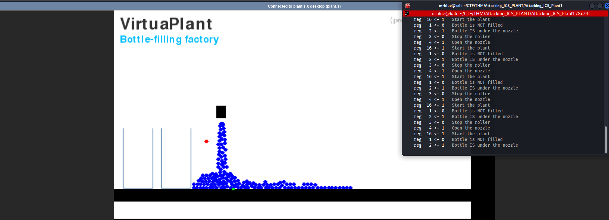
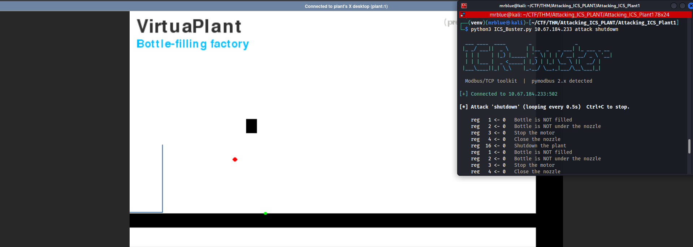

# TryHackMe — Attacking ICS Plant 1

**Author:** mrblue
**Category:** ICS / SCADA · Modbus/TCP
**Target:** `10.67.184.233` (VirtuaPlant "Bottle-filling factory")
**Tooling:** a custom single-file Modbus toolkit, `ICS_buster.py`

---

## 1. Background

This room drops you in front of a simulated **bottle-filling plant** built on
[VirtuaPlant](https://github.com/jseidl/virtuaplant). The plant is controlled by
a PLC that speaks **Modbus/TCP** on port `502`.

A few concepts worth pinning down first:

- **SCADA** (Supervisory Control and Data Acquisition) is the umbrella term for
  the systems that monitor and control industrial processes.
- A **PLC** (Programmable Logic Controller) is the small computer that actually
  reads the sensors and drives the actuators.
- **Modbus** is the field protocol tying it together. It is old, simple, and — by
  design — has **no authentication and no encryption**. Anyone who can reach TCP
  502 can read and write the PLC's registers. That single fact is the whole game.

The plant runs a three-phase cycle:

1. **Initialization** — the roller brings the first empty bottle under the nozzle.
2. **Filling** — the nozzle opens and water flows into the bottle.
3. **Moving** — once full, the roller advances the next empty bottle into place.

After phase 3 it loops back to phase 2.

---

## 2. Environment setup

The room ships a set of Python scripts (`discovery.py`, `set_registry.py`,
`attack_*.py`) that target the PLC with the `pymodbus` library. Two problems show
up immediately on a modern Kali box:

1. `discovery.py` crashes with `IndexError: list index out of range` — it reads
   the target IP from `sys.argv[1]` but was run with no argument.
2. The scripts `import` from `pymodbus.client.sync`, a namespace that was
   **removed in pymodbus 3.x**. On a fresh venv you get `ModuleNotFoundError`.

Rather than patch each script one at a time, I consolidated everything the room
needs into one tool.

### ICS_buster.py

`ICS_buster.py` is a single-file Modbus/TCP toolkit that replaces the whole pile
of room scripts and works on both pymodbus 2.x and 3.x (it also handles the
`unit=` → `slave=` keyword rename between those versions).

| Old script            | ICS_buster command                         |
|-----------------------|--------------------------------------------|
| `discovery.py`        | `monitor` / `read`                         |
| `set_registry.py`     | `write <reg> <val>`                        |
| `attack_move_fill.py` | `attack move-fill`                         |
| `attack_stop_fill.py` | `attack stop-fill`                         |
| `attack_shutdown.py`  | `attack shutdown`                          |
| *(new)*               | `analyze` — samples the PLC and prints the room's answer key |

```bash
# recon
python3 ICS_Buster.py 10.67.184.233 read
python3 ICS_Buster.py 10.67.184.233 monitor
python3 ICS_Buster.py 10.67.184.233 analyze --duration 30

# interaction
python3 ICS_Buster.py 10.67.184.233 write 4 1
python3 ICS_Buster.py 10.67.184.233 attack stop-fill --interval 0.05
python3 ICS_Buster.py 10.67.184.233 attack shutdown
```

### The two Modbus primitives (Task 2)

Everything the tool does comes down to two `pymodbus` calls:

| Operation                 | pymodbus function        |
|---------------------------|--------------------------|
| Read holding registers    | `read_holding_registers` |
| Write a holding register  | `write_register`         |

`read_holding_registers` is how we observe the plant; `write_register` is how we
change it. Reading is passive reconnaissance; writing is the actual attack.

---

## 3. Understanding the plant (Task 3)

### Normal operation

Connecting to the plant in the browser and letting it run shows the process
cycling on its own: empty bottles wait on the left, one sits under the nozzle
filling, and full bottles queue up on the right.



The three components that matter are highlighted above:

- **Black block** — the **nozzle** (an actuator).
- **Red dot**, at fill height near the nozzle — the **water-level sensor**. Its
  position is the clue: it sits where it can detect liquid reaching the top of a
  bottle.
- **Green dot**, at conveyor-floor level — the **bottle-position sensor**. It sits
  where a bottle arrives, so it detects a bottle being present.

### Reading the registers

A one-shot read of the holding registers shows the address space. The plant
exposes **16 registers**, but only five carry meaning — the rest sit dead at `0`.



From this and the room's own attack scripts, the register map is:

| Register | Type     | Meaning                              |
|:--------:|----------|--------------------------------------|
| 1        | Sensor   | Water-level sensor (bottle filled)   |
| 2        | Sensor   | Bottle sensor (bottle under nozzle)  |
| 3        | Actuator | Roller / motor                       |
| 4        | Actuator | Nozzle                               |
| 16       | Master   | Plant run / start (1 = on, 0 = off)  |

### Watching state change

Running `monitor` streams the registers once per second. Two states alternate as
the plant cycles between filling and moving — registers 1–4 flip while register
16 stays pinned at `1`:

```
Filling:  [0, 1, 0, 1, 0, 0, 0, 0, 0, 0, 0, 0, 0, 0, 0, 1]
Moving:   [1, 0, 1, 0, 0, 0, 0, 0, 0, 0, 0, 0, 0, 0, 0, 1]
```



### Auto-analysis

The `analyze` command samples the plant for 30 seconds and computes the answers
directly — how many registers change, their min/max, which one holds, and which
registers are active in each phase.



The per-register change summary makes the split obvious: registers 1–4 are
`CHANGING`, registers 5–15 are unused (`holding` at 0), and register 16 is
`holding` at 1.



### Task 3 answers

| Question                                             | Answer            |
|------------------------------------------------------|-------------------|
| How many phases can we observe?                      | **3**             |
| How many sensors can we observe?                     | **2**             |
| How many actuators can we observe?                   | **3**             |
| Using `discovery.py`, how many registers can we count? | **16**          |
| After a bottle is loaded, how many registers change? | **4**             |
| Minimum observed value                               | **0**             |
| Maximum observed value                               | **1**             |
| Which register is holding its value?                 | **16**            |
| Registers set to 1 while the nozzle is filling       | **2 and 4** (entered as `24`) |
| Registers set to 1 while the roller is moving        | **1 and 3** (entered as `13`) |
| Colour of the water-level sensor                     | **Red**           |
| Colour of the bottle sensor                          | **Green**         |
| Register associated with the roller                  | **3**             |
| Register associated with the water-level sensor      | **1**             |

**Note on the actuator count:** the answer is **3**, not 2. The plant has three
things we can drive: the **start/stop button (register 16)**, the **roller
(register 3)**, and the **nozzle (register 4)**. It's easy to miss the start/stop
button because it isn't part of the visible fill/move cycle — but it is an
actuator, since writing to it changes the plant's state.

**Note on answer format:** the two "registers set to 1" questions expect the
register numbers with no separator, so `2 and 4` is entered as **`24`** and
`1 and 3` as **`13`**.

**Reasoning for roller vs. water-level sensor:** both register 1 and register 3
are `1` during the moving phase, so you can't tell them apart by value alone. At
the *very beginning* (initialization) the roller must run to bring in the first
bottle, but nothing is filled yet — so the register that is `1` at the start is
the **roller (3)**, and its move-phase partner is the **water-level sensor (1)**.

---

## 4. Finding the nozzle register (Task 4)

Registers **2 and 4 always share the same value**, so watching them can't tell you
which is the nozzle actuator and which is the bottle sensor. The trick is a core
ICS idea:

> A **sensor** reflects reality. An **actuator** *controls* it.
> So **write** to a register and see whether the plant physically reacts.

### The test

First I stopped the roller so nothing moved on its own, then wrote `1` to
register 4:

```bash
python3 ICS_Buster.py 10.67.184.233 write 4 1
```



A single write gets overwritten by the PLC's own program on the next cycle, so to
hold the nozzle open I looped the `stop-fill` play (bottle held under nozzle,
nozzle open, roller stopped) at a tight interval so my writes win the race:

```bash
python3 ICS_Buster.py 10.67.184.233 attack stop-fill --interval 0.05
```

The result is unambiguous — the nozzle stays wide open and water pours out
continuously, overflowing because the roller never advances the bottle:



Writing to register 4 caused a **physical action** (the nozzle opened). A sensor
register would not do that. Register 2, by contrast, only tells the logic "a
bottle is present" and produces no water flow — confirming it is the sensor.

### Task 4 answer

| Question                                | Answer  |
|-----------------------------------------|---------|
| Which register is associated with the nozzle? | **4** |

---

## 5. Bonus — process disruption

Because Modbus lets us write freely, we can do more than open a valve. The
`shutdown` play zeros every control register — bottle flags, roller, nozzle, and
the master run bit — halting the entire process:

```bash
python3 ICS_Buster.py 10.67.184.233 attack shutdown
```



The plant freezes: nozzle closed, roller stopped, nothing on the conveyor. In a
real facility this is a denial-of-service against a physical process — the kind of
attack that stops a production line or, on less benign equipment, causes real
damage.

---

## 6. Takeaways

- **Modbus has no security by design.** No authentication, no integrity, no
  encryption. Reachability equals full read/write control of the process.
- **Sensors vs. actuators:** you distinguish them by writing and observing —
  actuators change the physical world, sensors merely report it.
- **Defence** for real ICS is about the network, not the protocol: strict
  segmentation, firewalls/data diodes between IT and OT, and monitoring for
  unexpected Modbus writes. You cannot bolt auth onto Modbus itself, so you keep
  attackers off the wire.

---

*Room completed. All 11 observation questions and the nozzle disambiguation
solved with `ICS_buster.py`; sensor colours read directly off the HMI.*
