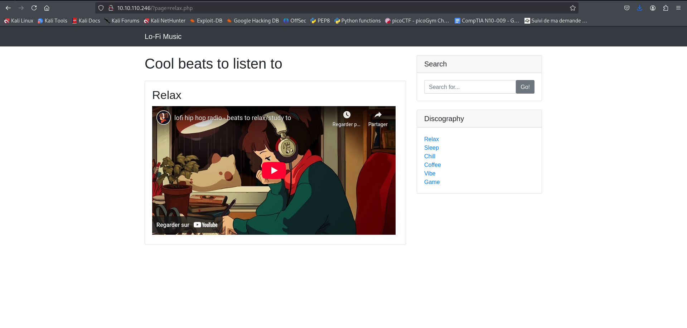
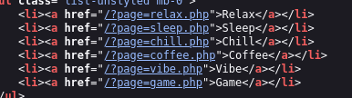
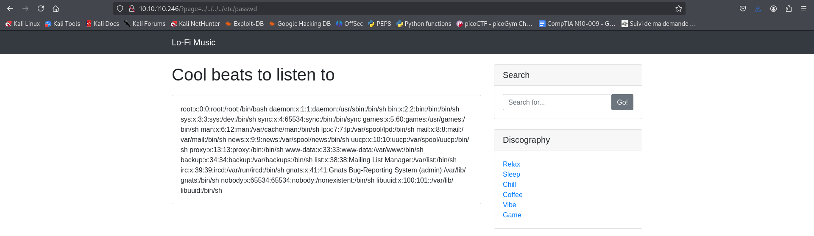
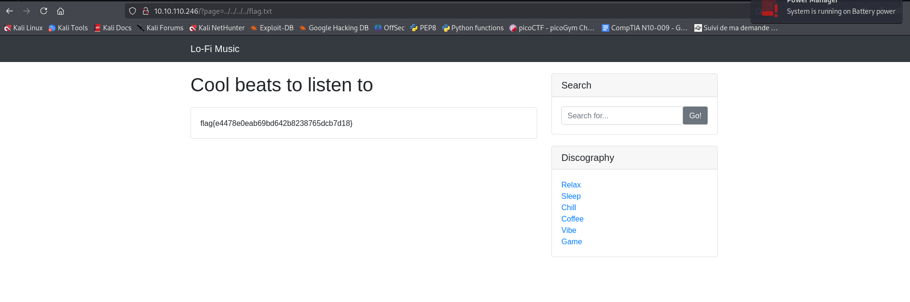

## TryHackMe | LoFi challenge

## 🔍 First look at the webpage

## 🪲 Look at the vulnrable part of the source code, for Local File Inclusion (LFI) 

💡 Then we use path traversal to read the contents of the file.
    
-  We can gather users from /etc/passwd

-  We can get our flag from /var/www/html/flag.txt or ../../../../flag.txt

