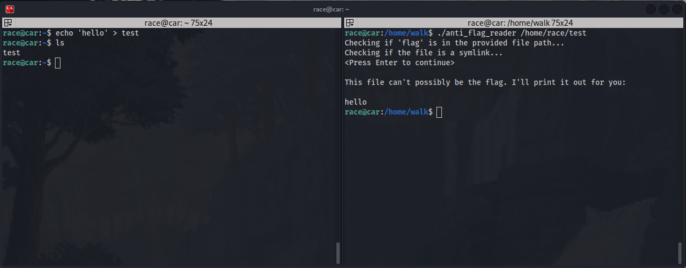
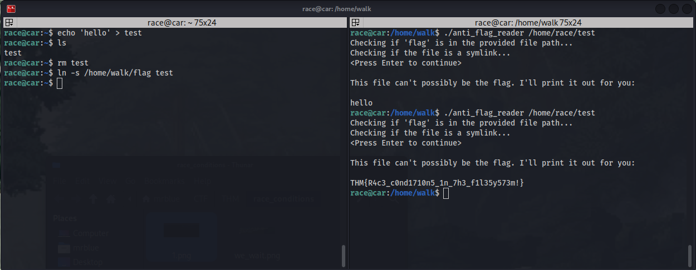

## TryHackMe | Race Conditions

## Challenge 1

The code is in anti_code_reader.c

## Explenation:
Secure Flag Reader: Intent vs. Vulnerability (https://en.wikipedia.org/wiki/Time-of-check_to_time-of-use)

This C program is designed as a secure flag reader. It takes a file path as an argument and performs two crucial security checks before proceeding:

    It verifies that the file path doesn't contain the string "flag."
    It ensures the file isn't a symbolic link.

If both checks pass, the program then prints the file's contents.
The Race Condition Vulnerability

Despite these checks, the program has a race condition vulnerability. This occurs because the program's outcome can be manipulated by the timing of external, uncontrollable events.

Specifically, there's a critical window after the security checks are completed but before the program opens the file for reading. A malicious user could exploit this window by quickly replacing the "safe" file (the one that passed the checks) with a symbolic link pointing to the sensitive "flag" file. Since the checks have already run, they won't detect this switch, and the program will unwittingly open and display the contents of the flag file.
Exploiting the Vulnerability

To demonstrate this vulnerability, we'll create a test file in the /home/race directory, as we lack permissions to create one in /home/walk.

To create this test file, you'll need to open another SSH session.

Now in /home/walk we try to read the content of the test file. And we wait, dont press enter yet. In another ssh session follow the steps
of the left ssh session and you will get the flag

## Challenge 2

Next, we'll navigate to the /home/run directory and analyze the cat2.c code.

