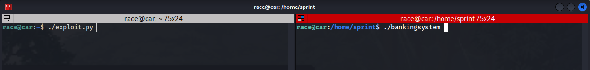
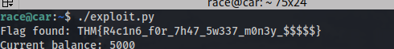

## TryHackMe | Race Conditions

## Challenge 1

The code is in anti_code_reader.c

## Explenation:
Secure Flag Reader: Intent vs. Vulnerability (https://en.wikipedia.org/wiki/Time-of-check_to_time-of-use)

This C program is designed as a secure flag reader. It takes a file path as an argument and performs two crucial security checks before proceeding:

    It verifies that the file path doesn't contain the string "flag."
    It ensures the file isn't a symbolic link.

If both checks pass, the program then prints the file's contents.
The Race Condition Vulnerability

Despite these checks, the program has a race condition vulnerability. This occurs because the program's outcome can be manipulated by the timing of external, uncontrollable events.

Specifically, there's a critical window after the security checks are completed but before the program opens the file for reading. A malicious user could exploit this window by quickly replacing the "safe" file (the one that passed the checks) with a symbolic link pointing to the sensitive "flag" file. Since the checks have already run, they won't detect this switch, and the program will unwittingly open and display the contents of the flag file.
Exploiting the Vulnerability

To demonstrate this vulnerability, we'll create a test file in the /home/race directory, as we lack permissions to create one in /home/walk.

To create this test file, you'll need to open another SSH session.

Now in /home/walk we try to read the content of the test file. And we wait, dont press enter yet. In another ssh session follow the steps
of the left ssh session and you will get the flag

## Challenge 2

Next, we'll navigate to the /home/run directory and analyze the cat2.c code.

## Understanding the Race Condition in cat2.c

The cat2.c program, intended as a more secure version of cat, unfortunately harbors a race condition vulnerability. This flaw stems from a critical time gap between when the program performs a security context check and when it actually opens the file for reading.

Here's how it breaks down:

    Security Check: The program first verifies if the user has the necessary permissions to access the file.
    Vulnerable Window: Critically, there's a deliberate half-second pause (usleep(500)) immediately after this check. This artificial delay creates a window of opportunity for an attacker.
    File Open: After the pause, the program proceeds to open the file.

How the Exploit Works

An attacker can exploit this vulnerability by performing a precise file swap. Right after the program completes its security check, but just before the open() operation executes, the attacker can replace the legitimate file with a restricted file or a symbolic link to a restricted file. Because the security check has already passed, the program will then unknowingly open and process the unauthorized file.

Despite its design as a more secure cat command with extra user context checks, this timing discrepancy completely undermines its security, making it susceptible to exploitation.
Exploiting the Vulnerability

To demonstrate this vulnerability, we'll create a small bash script named run.sh in SSH session 2. 

The run.sh script is designed to rapidly create, replace, and delete a test file. Its goal is to insert a symbolic link pointing to the /home/run/flag file within the precise, brief window that exists between the vulnerable program's security checks and its subsequent open() operation.

If this timing attack is successful, the program will inadvertently read and output the contents of the flag file, completely bypassing its intended security measures.

To execute this exploit:

    In SSH session 2, run your script:
    Bash

bash run.sh

Simultaneously (or immediately after starting the script), in SSH session 1, execute the vulnerable command:
Bash

    ./cat /home/race/test

This synchronized execution aims to reveal the flag. (NOTE: you might need the spam the enter button in session two to make it work)

## Challenge 3

This was bit tricky challenge, and it needed a little bit of scripting knowledge to solve it.

This script sets up a networked banking system, running a multithreaded server on port 1337. It's built to let clients deposit money, withdraw it, or even buy a special "flag." Basically, it handles each client connection in its own dedicated thread.
The Sneaky Flaw: A Race Condition

Here's where things get tricky: The core problem in this banking system is a classic race condition revolving around the shared money variable. Think of it like multiple people trying to update the same bank balance at the exact same time. When many threads can access and change this money variable concurrently, its value can get messed up because of how operations are timed.

Specifically, if someone times their "withdraw" and "purchase flag" commands just right, they can actually buy the flag even if they don't have enough funds! The system might approve the flag purchase before it fully processes a simultaneous withdrawal. That's a huge security hole.
My Exploit: A Python Attack Script

To show just how vulnerable this is, I've put together a Python script. It's designed to unleash multiple threads that hammer the server simultaneously with "deposit," "withdraw," and "purchase flag" commands. The whole idea is to trigger that race condition, letting us snatch the "flag" without the necessary balance.

The script continuously runs the deposit and withdraw functions, but the purchase_flag function has a slight delay. This delay is key; it helps create the perfect timing for the exploit to work.

Oh, and to keep things clean and stop bombarding the server endlessly, I've added a neat check in the purchase_flag function. Once we snag the flag, the script knows to stop sending more requests.

We now execute the ./bankingsystem program in SSH session 1 and then run our exploit in SSH session 2. (NOTE: dont forget to make your exploit.py executable with "chmod +x exploit.py")

The bankingsystem program can be seen receiving connection, while our exploit reads out the flag.

