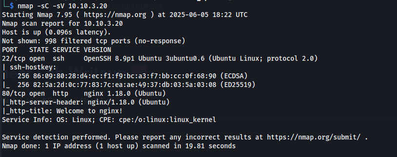

## TryHackMe | Mountaineer challenge

🔍 Recon

When we try to see the webpage "https://mountaineer.thm/wordpress/" it says server not found.
We need to change our /etc/hosts file with the dns

📂 Hosts File Update

We add "<ip> mountaineer.thm" to our host file

Then finely can we see the webpage!

🔐 WordPress Vulnerability Scan

We also get a list of usernames

🔍 More Directory Search

Lets turn on BurpSuite and intercept some things, below we find this website is vulnarable to path traversal.

We can read the /etc/passwd file

Here we see another domain we can use.

We also find another path

📂 Hosts Update for Admin Access

We add "<ip> mountaineer.thm adminroundcubemail.mountaineer.thm" the it to our /etc/hosts file.

Trying random logins such as user:user, k2:k2 found it was the password

We find out some information about Lhotse

We find a security risk

And we find the admins credentials "th3_tall3st_password_in_th3_world"

With the credentials we find we can login at "http://mountaineer.thm/wordpress/wp-admin/"

🛠️ Exploring WordPress Plugins

We can find our exploit here "https://www.exploit-db.com/exploits/50082"

And we can run it using this command

We get a shell

After some manual digging we find "Backup.kdbx" at /home/lhotse#

We start a netcat listener on our machine to get the file:

And on the victims side we use:

We got it

📜 Generating Password Lists

Creating a wordlist with cupp

🔓 Cracking the Backup.kdbx File

Convert the Backup file to a has

The cracked hash

    └─$ john keepass_hash --wordlist=mount.txt 
    Using default input encoding: UTF-8
    Loaded 1 password hash (KeePass [SHA256 AES 32/64])
    Cost 1 (iteration count) is 60000 for all loaded hashes
    Cost 2 (version) is 2 for all loaded hashes
    Cost 3 (algorithm [0=AES 1=TwoFish 2=ChaCha]) is 0 for all loaded hashes
    Will run 16 OpenMP threads
    Press 'q' or Ctrl-C to abort, almost any other key for status
    Lhotse56185      (Backup)     
    1g 0:00:00:13 DONE (2025-06-05 15:55) 0.07558g/s 237.0p/s 237.0c/s 237.0C/s Lhotse45..Lhotse71
    Use the "--show" option to display all of the cracked passwords reliably
    Session completed. 

With this we can crack the backup and find the credentials for another users

🔑 SSH Access

We have ssh access to the machine

With this we can cat local.txt for our first flag

📂 Analyzing Bash History

Doing some enumeration and looking at the bash history we find the password for root

We can use this to login as root, then cat local.txt and voila the challenge is done

