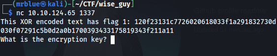
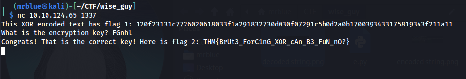

## TryHackMe | W1seGuy

## Approach

We can leverage a common assumption in CTF (Capture The Flag) challenges: flags often start with a known pattern. In this case, we'll assume the plaintext flag begins with THM{.

    Determining the First Four Key Characters:
    If we assume the plaintext starts with THM{, we can determine the first four characters of the key by XORing these known plaintext characters with the corresponding first four characters of the ciphertext. Since the key repeats every five characters, this gives us a significant head start.

    Let P be the plaintext, C be the ciphertext, and K be the key. The XOR operation is defined as Pi​⊕Ki​=Ci​. Therefore, Ci​⊕Pi​=Ki​.
        K0​=C0​⊕’T’
        K1​=C1​⊕’H’
        K2​=C2​⊕’M’
        $K_3 = C_3 \oplus \text{'{'}$

## The source code

    import random
    import socketserver 
    import socket, os
    import string
    
    flag = open('flag.txt','r').read().strip()
    
    def send_message(server, message):
        enc = message.encode()
        server.send(enc)
    
    def setup(server, key):
        flag = 'THM{thisisafakeflag}' 
        xored = ""
    
        for i in range(0,len(flag)):
            xored += chr(ord(flag[i]) ^ ord(key[i%len(key)]))
    
        hex_encoded = xored.encode().hex()
        return hex_encoded
    
    def start(server):
        res = ''.join(random.choices(string.ascii_letters + string.digits, k=5))
        key = str(res)
        hex_encoded = setup(server, key)
        send_message(server, "This XOR encoded text has flag 1: " + hex_encoded + "\n")
        
        send_message(server,"What is the encryption key? ")
        key_answer = server.recv(4096).decode().strip()
    
        try:
            if key_answer == key:
                send_message(server, "Congrats! That is the correct key! Here is flag 2: " + flag + "\n")
                server.close()
            else:
                send_message(server, 'Close but no cigar' + "\n")
                server.close()
        except:
            send_message(server, "Something went wrong. Please try again. :)\n")
            server.close()
    
    class RequestHandler(socketserver.BaseRequestHandler):
        def handle(self):
            start(self.request)
    
    if __name__ == '__main__':
        socketserver.ThreadingTCPServer.allow_reuse_address = True
        server = socketserver.ThreadingTCPServer(('0.0.0.0', 1337), RequestHandler)
        server.serve_forever()

From this we can see the zor operation being applied to the flag with the key:
    
    flag = 'THM{thisisafakeflag}' 
            xored = ""
        
            for i in range(0,len(flag)):
                xored += chr(ord(flag[i]) ^ ord(key[i%len(key)]))
                
The key is generated randomly from ASCII letters and digits

    res = ''.join(random.choices(string.ascii_letters + string.digits, k=5))
    key = str(res)

We can see our encoded string:

We can use the e.py script to decode the xor encoded cyphertext providing:

    1: The key lenght
    2: the first 4 letters "THM{"
    3: The last letter "}"

This will decode the key The decoded cypher is the first flag:

And the second flag is given by the server:

    
